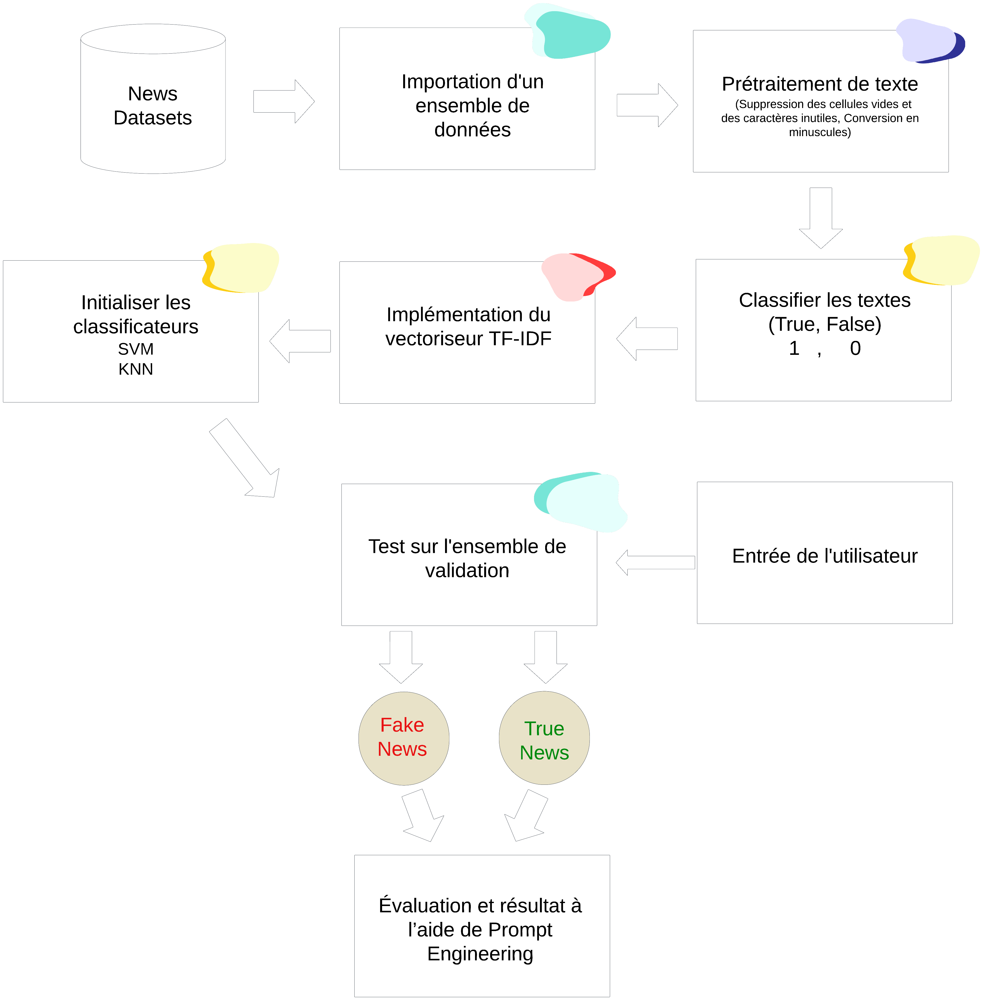

# Fake News Detection :iphone: :computer: :mag:


 

## A propos
Dans ce projet, nous avons utilisé le langage Python ainsi que des algorithmes d'apprentissage automatique (Machine Learning) tels que SVM et k-NN pour classifier les faux et les vrais articles de presse. Nous avons exploité un ensemble de bibliothèques Python comme scikit-learn, et pour la détection, nous avons utilisé un modèle de langage naturel (LLM).


## Démarrage
Ces instructions vous permettront d'obtenir une copie du projet opérationnel sur votre ordinateur local à des fins de développement et de test.


## Exigences

- Python 3.12.0
  * Cette configuration nécessite que Python 3.12.0 soit installé sur votre machine. vous pouvez vous référer à cette URL https://www.python.org/downloads/ pour télécharger python. Une fois Python téléchargé et installé, vous devrez configurer les variables PATH (si vous souhaitez exécuter le programme Python directement, les instructions détaillées sont ci-dessous dans la section Comment exécuter le logiciel).
  * Pour ce faire, vérifiez ceci : https://www.pythoncentral.io/add-python-to-path-python-is-not-recognized-as-an-internal-or-external-command/.
- La deuxième option, la plus simple, consiste à télécharger anaconda et à utiliser son invite anaconda pour exécuter les commandes. Pour installer anaconda, vérifiez cette URL https://www.anaconda.com/download/
- Vous devrez également télécharger et installer les 3 packages ci-dessous après avoir installé Python ou Anaconda à partir des étapes ci-dessus.
Sklearn (scikit-learn)
  *	numpy
  *	seaborn
  *	worldcloud
  *	pandas

- Si vous avez choisi d'installer python 3.12.0, exécutez les commandes ci-dessous dans l'invite de commande/le terminal pour installer ces packages.
```bash
pip install -U scikit-learn
pip install numpy
pip install wordcloud
pip install seaborn
pip install pandas
```


- Si vous avez choisi d'installer anaconda, exécutez les commandes ci-dessous dans l'invite anaconda pour installer ces packages

```bash
 conda install -c scikit-learn
 conda install -c anaconda numpy
 conda install -c anaconda wordcloud
 conda install -c anaconda seaborn
 conda install -c anaconda pandas
```
## Dataset
Les données proviennent de Kaggle, vous pouvez les télécharger ici :
  *	Référence - https://www.kaggle.com/code/therealsampat/fake-news-detection/input
Il existe deux fichiers, un pour les vraies nouvelles et un pour les fausses nouvelles (tous deux en anglais) avec un total de 17 903 « faux » tweets et 20 826 « vrais » articles.


## Schéma

 
